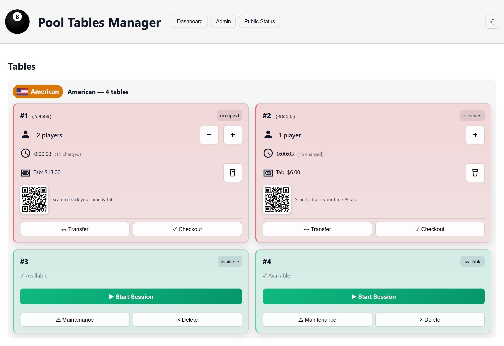
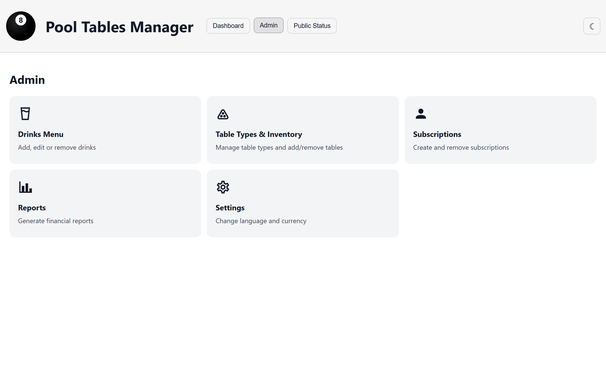
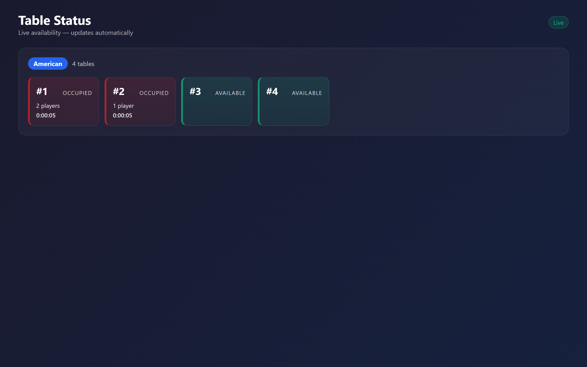
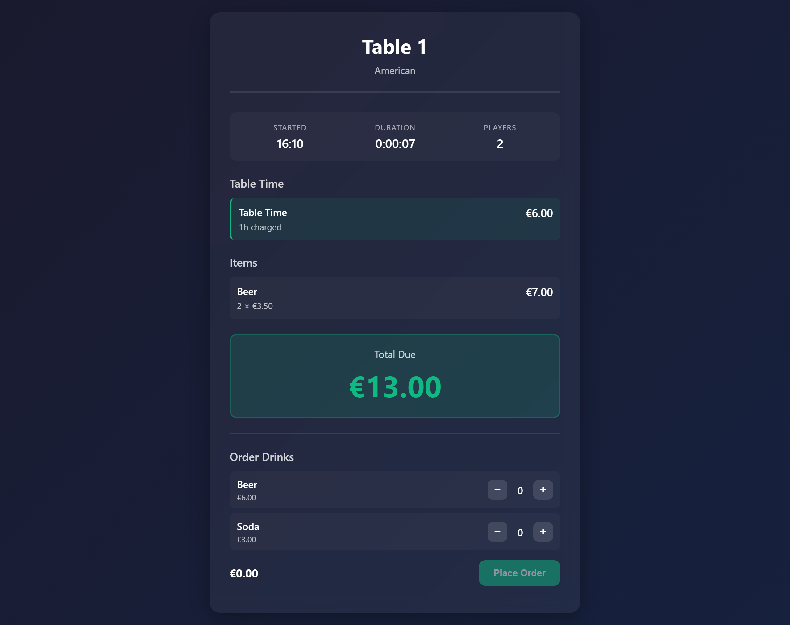

# Pool Tables Manager

A full-featured pool hall management system with session tracking, billing, subscriptions, and reporting.

## Features

- **Session Management**: Track active sessions, players, and table usage
- **Billing System**: Automated time-based billing with subscriber discounts
- **Subscriptions**: Monthly subscription management with automatic discounts
- **Pending Orders**: Players can order drinks from their phone (PIN-protected); staff fulfill them from a dashboard queue with an audio notification
- **QR Codes**: Each active table shows a QR code linking directly to its player view, with a configurable public hostname
- **Reporting**: Financial reports by day/week/month/quarter/year
- **French VAT (TVA) Compliance**: Per-item VAT rates, an anti-tamper sale audit trail, sequential receipts, period closures, and a VAT report with CSV export — see [VAT-COMPLIANCE.md](VAT-COMPLIANCE.md)
- **Authentication**: OIDC integration or local admin authentication
- **Multi-language**: English and French support

## Screenshots

**Dashboard** — live sessions with running timers, tabs, per-table QR codes, and one-click actions:



**Admin panel** — drinks menu, table types & inventory, subscriptions, reports, and settings:



**Public table status board** (`/status`) — no login required, updates automatically as tables are used or freed:



**Player table view** — the page players reach by scanning the table's QR code (PIN-protected): live timer, tab, and drink ordering from their phone:



## Quick Start

**New Deployment** (empty database):
```bash
git clone <repository-url>
cd pool-tables-manager
docker-compose up -d
```

The application will automatically initialize the database and apply all migrations.

**Access**: Open http://localhost:3000

**First Setup**: Configure local admin password or OIDC authentication via Settings page.

## Documentation

- **[DEPLOYMENT.md](DEPLOYMENT.md)**: Complete deployment guide for new and existing instances
- **[DEVELOPER_README.md](DEVELOPER_README.md)**: API documentation and development guide
- **[USER_GUIDE.md](USER_GUIDE.md)**: User documentation and feature overview
- **[VAT-COMPLIANCE.md](VAT-COMPLIANCE.md)**: French VAT/anti-fraud conformity notes
- **[UPGRADE-GUIDE.md](UPGRADE-GUIDE.md)**: How the Node 22 / PostgreSQL 18 / Prisma 6 upgrade was performed, plus a reusable checklist
- **[backend/tests/README.md](backend/tests/README.md)**: Testing documentation and CI integration

## Architecture

**Services**:
- `app`: Node.js/Express backend + static frontend
- `db`: PostgreSQL database

**Technology Stack**:
- Backend: Node.js 22, Express, Prisma ORM
- Database: PostgreSQL 18
- Frontend: Vanilla JavaScript
- Testing: Jest + Supertest
- CI/CD: GitHub Actions

## Development

```bash
# Run tests
cd backend
npm test

# Run tests in Docker
docker run --rm --network pool-tables-manager_default \
  -v $(pwd)/backend:/app -w /app node:18-bullseye \
  bash -c "npm test"

# Access database
docker exec -it pool-tables-manager-db-1 psql -U postgres -d pool_tables

# View logs
docker-compose logs -f app
```

## Updating

```bash
git pull
docker-compose down
docker-compose build
docker-compose up -d
```

## Support

For deployment issues, see [DEPLOYMENT.md](DEPLOYMENT.md).

For API documentation, see [DEVELOPER_README.md](DEVELOPER_README.md).
